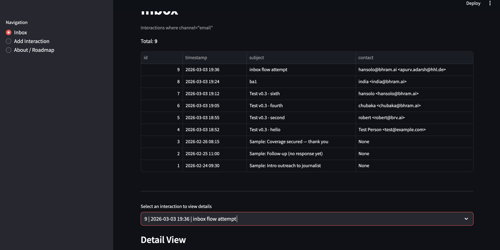

<<<<<<< HEAD
# Communication Ops OS (ComOps) — v0 (Local-first)
=======

# Communication Ops OS (ComOps) — v0.1 (Runnable Foundation)
>>>>>>> origin/main

A local-first “communication operations mini-OS” that stores outreach events and later turns them into tasks + reporting.

## Product idea (PM framing)
**Problem:** Outreach work (PR, partnerships, sales, recruiting) gets messy fast — follow-ups are missed, context is scattered, and reporting becomes manual.  
**Goal:** Build a small, reusable engine that records *communication events* and later converts them into tasks + reporting.

### Core decision (important)
We store **Interaction** (channel-aware event), not “Message”.
- Email is just: `Interaction where channel="email"`
- Later, WhatsApp/calls are also Interactions (same engine).

This keeps the core engine reusable for future **PR Outreach OS (PRO)**.

---

## Current Release: v0.2 — Sample Data Loader + Persistence Proof

### What shipped
- A button in the app: **“Load sample emails”**
- Seeds **3 sample email interactions** into SQLite (`app.db`)
- Clicking again does **NOT** create duplicates  
  (you’ll see “inserted=0, skipped=3” on the second click)

### “Idempotent” in simple words
You can click the load button multiple times, and it will **not duplicate** the same sample emails.

### Release notes (v0.2)
- Added an **idempotent sample email loader** (`sample_data.py`) that inserts 3 emails once
- Added a **Streamlit button** to load sample emails and show `inserted / skipped` counts
- Inbox lists seeded email interactions from SQLite (`app.db`) and persists across restarts

---

## Run locally
```bash
python3 -m venv .venv
source .venv/bin/activate
python3 -m pip install -r requirements.txt

# optional
cp .env.example .env


===== COPY START: README.md (FULL FILE) =====

# Communication Ops OS (ComOps) v0

A **local-first communication operations mini-OS** built as a reusable engine for future **PR Outreach OS (PRO)**.

**Core concept:** we store **Interactions** (channel-aware) as the base record — not “messages”.  
- Email inbox = `Interaction where channel="email"`
- Later: WhatsApp / calls are also Interactions (same engine).

> RAG is **not** a priority right now.

---

## Who is this for?

- **Solo operators / agencies** who do outreach and need a lightweight system of record
- PM/TPM portfolio: demonstrates **data modeling + workflow thinking + incremental releases**

---

## Scope (current)

### ✅ Shipped in v0.3
- **Manual ingestion:** create an Interaction from a form (default `channel="email"`)
- **Inbox:** list interactions (newest first) with stable selection
- **Detail View:** show subject / timestamp / channel / body / contact summary
- **Persistence:** data stored in SQLite (`app.db`) and persists across restarts
- **DB compatibility:** lightweight SQLite migration to add missing columns (contact fields)

### 🚫 Non-goals (not in v0.3)
- AI extraction / LLM calls (Session 4)
- Task queue (Session 5)
- Reporting/dashboard (Session 6)
- External integrations (Gmail/WhatsApp APIs)
- PR-specific fields (outlet/beat/DNP)

---

## Architecture (simple + portfolio-friendly)

- **UI:** Streamlit
- **Storage:** SQLite (`app.db`)
- **ORM:** SQLModel
- **Pattern:** small helper layer in `db.py` (CRUD + schema init/migration)

---

## Data model

### `Interaction`
- `id` (int, primary key)
- `channel` (string; default `email`)
- `subject` (string)
- `body` (string)
- `timestamp` (datetime)
- `contact_name` (optional)
- `contact_email` (optional)

---

## Repo structure

- `app.py` — Streamlit UI (Inbox, Add Interaction, Detail View)
- `models.py` — SQLModel table definitions
- `db.py` — SQLite engine + init/migration + CRUD helpers
- `app.db` — local SQLite database (should be gitignored)

---

## Run locally

```bash
python3 -m venv .venv
source .venv/bin/activate
python3 -m pip install --upgrade pip
python3 -m pip install -r requirements.txt

python -m streamlit run app.py
```

> If you want a “fresh start”, stop Streamlit and delete `app.db`, then rerun.

---

## How to verify v0.3 (manual smoke tests)

- **T1:** Add Interaction → create a record → success message shows
- **T2:** Inbox → new record appears → select it → Detail View fields match
- **T3:** Restart Streamlit → record still exists
- **T4:** Create 2 more → Inbox ordering is newest-first and selection still works

---

## Screenshots (optional, recommended)

Add images here:
- `docs/screenshots/v0.3-inbox.png`

- `docs/screenshots/v0.3-add-interaction.png`

- `docs/screenshots/v0.3-detail-view.png`


And reference them like:
```md

```

---

## Releases

### v0.1 — Scaffold
- Streamlit app scaffold
- Basic project structure (UI + DB layer)

### v0.2 — SQLite persistence baseline
- SQLite-backed Inbox foundation (seed sample data when DB is empty)
- Persist data across restarts (local-first)

### v0.3 — Manual Ingestion + Interaction Detail View
- Manual Add Interaction form (default email channel)
- Inbox list + stable selection
- Detail View (subject/body/timestamp/channel + contact)
- Lightweight SQLite migration for contact fields

---

## Roadmap (locked 6-session plan)

### v0.4 — AI Extraction (Session 4)
- Extract structured fields from subject/body (no external integrations)
- Show extracted fields with a review/edit step
- Persist extraction results to DB

### v0.5 — Task Queue (Session 5)
- Convert interactions → follow-up tasks (local-first)
- Basic task state + due dates

### v0.6 — Reporting (Session 6)
- Lightweight operational reporting (e.g., volume, follow-ups due, response rate proxies)

---

## Key PM decisions & tradeoffs

- **Interaction-first** model to keep engine reusable across channels
- **Local-first SQLite** to ship fast and keep portfolio demo simple
- **No heavy migrations framework** (we use minimal “ALTER TABLE if missing column”)
- **No integrations yet** until core workflow is proven

---

## License / usage
Portfolio / learning project. Use freely for experimentation.

===== COPY END: README.md (FULL FILE) =====